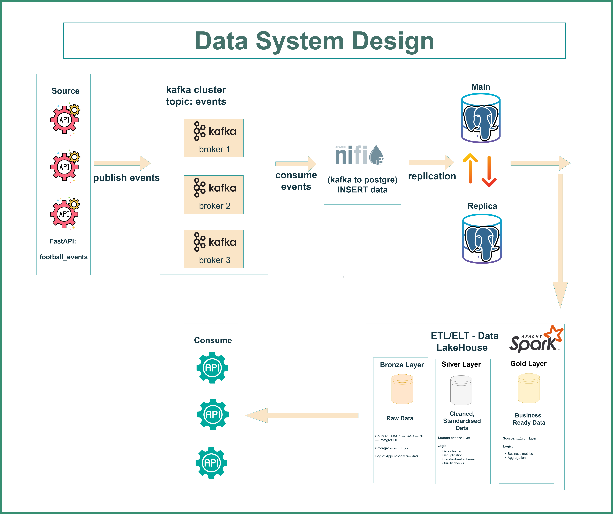

# Event Driven E-Commerce Data Platform
 
 
 
 
 

End-to-end real-time data engineering pipeline for e-commerce events, showcasing a Medallion architecture (Bronze → Silver → Gold), built with FastAPI, Kafka, NiFi, PostgreSQL, PySpark, Airflow, and containerized using Docker.
# 🚀 Architecture Overview

# ✅ Key Highlights

- Scalable real-time data streaming from FastAPI → Kafka(3-broker cluster) → NiFi → PostgreSQL

- Medallion Architecture: Bronze → Silver → Gold

- Automated ETL pipelines with PySpark and Airflow DAGs

- Clean, deduplicated, and business-ready datasets

- Analytics-ready tables for performance tracking, summary, and item-level fact tables

# 🖥 Data Architecture – Medallion Approach

| Layer     | Purpose                                                                         |
| --------- | ------------------------------------------------------------------------------- |
| 🥉 Bronze | Raw e-commerce order events landing zone from PostgreSQL public table           |
| 🥈 Silver | Cleaned, deduplicated, enriched events                                          |
| 🥇 Gold   | Business-ready tables: `order_summary`, `order_performance`, `order_items_fact` |

# 🚀 Pipeline Automation

The project includes Airflow DAGs to orchestrate PySpark transformations for all Medallion layers:

- Bronze → Silver → Gold

- Supports both batch and streaming ingestion

- Ensures scalability, reliability, and production-ready execution

# 🛠 Workflow Details

🥉 Bronze Layer

- Ingest raw order_events from PostgreSQL public table

- Landing zone for further transformations

- Deduplication and schema consistency handled in PySpark

🥈 Silver Layer

- Cleans and standardizes data

- Removes duplicates by event_id

- Adds processing timestamps (processed_ts)

🥇 Gold Layer

- Builds business-ready tables:

  - Order Summary (gold.order_summary) – latest order status

  - Order Performance (gold.order_performance) – KPIs like cycle time

  - Order Items Fact (gold.order_items_fact) – exploded product-level details

- Ensures accurate analytics through deduplication and timestamp-based ordering

# 📂 Repository Structure

Event-Driven_E-Commerce_Data_Platform/
┣ docker-airflow-spark-lakehouse/  → Docker setup, Airflow DAGs, PySpark pipeline scripts for Bronze, Silver, Gold layers
┣ docs/                            → Architecture diagram
┣ fastapi-kafka-producer/          → FastAPI APIs to simulate e-commerce order events and produce Kafka messages
┣ kafka_ui_screenshots/            → Kafka UI screenshots and monitoring visuals
┣ nifi_ui_screenshots/             → NiFi UI screenshots showing streaming flows
┣ postgresql/                      → SQL scripts for database creation, schemas, and Medallion tables

# 🎯 Target Audience

- Data Engineers & Analysts

- Students learning streaming pipelines, ETL, Medallion architecture

- Anyone building real-time data pipelines with Kafka, PySpark, and PostgreSQL

# 🛠 Technologies Used

- Python (FastAPI, PySpark)

- Kafka & NiFi (Streaming ingestion)

- PostgreSQL (Raw + Medallion tables)

- Airflow (DAG orchestration)

- Docker (Containerization)

# 🛡️ License

Licensed under the MIT License.

